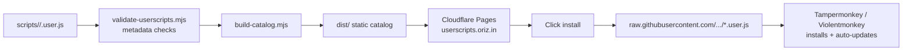

# userscripts

> A curated collection of small, single-purpose browser userscripts — with a searchable install catalog.

[](./LICENSE)
[](https://github.com/chirag127/userscripts/stargazers)
[](https://github.com/chirag127/userscripts/commits/main)
[](https://github.com/chirag127/userscripts)
[](https://github.com/chirag127/userscripts/actions/workflows/deploy.yml)

## What it is / why it exists

Browser extensions are heavy, permission-hungry, and often do one thing you could do with 30 lines of JS. This repo is a growing library of **atomic userscripts** — each does exactly one thing (skip Shorts, strip tracking params, restore right-click, add code-copy buttons, YouTube keyboard shortcuts, …) — plus an auto-generated, searchable **install catalog** so you can find and one-click-install any of them. Everything runs client-side in Tampermonkey / Violentmonkey / ScriptCat; nothing phones home.

## Links

- **Live catalog:** [userscripts.oriz.in](https://userscripts.oriz.in) — searchable install index (Cloudflare Pages)
- **Repo:** https://github.com/chirag127/userscripts
- Each script lives in [`scripts/<name>/<name>.user.js`](./scripts/) with its own `README.md`

⭐ **If this is useful, please star the repo — it helps others find it.**

## How it works



## Features

- **Atomic scripts** — one behavior per file; compose the ones you want
- **Searchable catalog** — the live site indexes every script's name, target site, and description
- **One-click install** — each catalog entry links to the raw `.user.js`; your manager auto-updates from `main`
- **Metadata validation** — `validate-userscripts.mjs` enforces well-formed `==UserScript==` headers before deploy
- **Auto-generated README table** — the catalog below is built, not hand-maintained
- **Zero tracking** — pure client-side scripts, no analytics

## Tech stack

- **Vanilla JavaScript** userscripts (Tampermonkey / Violentmonkey / ScriptCat metadata format)
- **Node.js** build scripts (ESM), **pnpm** package manager
- **Cloudflare Pages** hosting (`wrangler`, output dir `dist/`), custom domain `userscripts.oriz.in`
- **GitHub Actions** for validate → build → deploy

## Repo structure

```
scripts/
├── <name>/
│   ├── <name>.user.js          # the userscript itself
│   └── README.md               # per-script docs
├── build-catalog.mjs           # generates the catalog site + README table into dist/
└── validate-userscripts.mjs    # metadata header validation
wrangler.toml                   # Cloudflare Pages config (pages_build_output_dir = dist)
package.json                    # scripts: validate, build, lint
```

## Install a userscript

1. Install a userscript manager: [Tampermonkey](https://www.tampermonkey.net/) or [Violentmonkey](https://violentmonkey.github.io/)
2. Open [userscripts.oriz.in](https://userscripts.oriz.in) (or the table below) and click **install** next to any script
3. Your manager prompts to install and will auto-update it from this repo

## Build / deploy (for contributors)

```bash
pnpm install
pnpm run validate     # checks every userscript's metadata header
pnpm run build        # builds the catalog site into dist/
pnpm run lint         # validate + syntax-check the build script
```

Pushing to `main` runs `.github/workflows/deploy.yml`, which validates, builds the catalog, and deploys `dist/` to Cloudflare Pages.

## Part of the oriz family

One of ~80 small, single-purpose products in the **oriz** family. See the rest at [blog.oriz.in](https://blog.oriz.in).

## Cost

Hosting is **$0 on the Cloudflare Pages free tier**. The scripts themselves are free and run locally in your browser.

## Contributing

Add a folder under `scripts/<name>/` with a `<name>.user.js` (valid `==UserScript==` header) and a `README.md`. Run `pnpm run validate` before opening a PR — the catalog and this table regenerate automatically on deploy.

## Status / roadmap

**Stable and growing.** New atomic scripts are added regularly. Conventional commits are the changelog — see [the commit history](https://github.com/chirag127/userscripts/commits/main).

## License

MIT — see [`LICENSE`](./LICENSE).

## Author

Chirag Singhal · [chirag@oriz.in](mailto:chirag@oriz.in)

---

## Catalog

Personal userscripts collection by [@chirag127](https://github.com/chirag127). Tampermonkey / ScriptCat / Violentmonkey compatible.

Click **install** next to any userscript below, or open its folder for full docs. Your userscript manager will prompt to install and auto-update from this repo.

| Userscript | Site | What it does | Install |
|---|---|---|---|
| **[Add copy buttons to <pre><code> blocks](./scripts/add-code-copy-buttons/)** | any page | Inject a small "copy" button on every code block so you can grab the snippet without hand-selecting. One click copies innerText; button flashes "co... | [install](https://raw.githubusercontent.com/chirag127/userscripts/main/scripts/add-code-copy-buttons/add-code-copy-buttons.user.js) |
| **[AI chat — Auto-continue truncated responses](./scripts/ai-chat-auto-continue/)** | https://chatgpt.com/* | Auto-clicks the "Continue" button on ChatGPT / Claude / Gemini when a response is cut off by output-token limits, so long generations complete unat... | [install](https://raw.githubusercontent.com/chirag127/userscripts/main/scripts/ai-chat-auto-continue/ai-chat-auto-continue.user.js) |
| **[Restore right-click + selection + hotkeys](./scripts/anti-hijack-guard/)** | any page | Neutralises pages that block right-click, text selection, copy/cut, drag, and keyboard shortcuts. Stops the hijack at document-start before the hos... | [install](https://raw.githubusercontent.com/chirag127/userscripts/main/scripts/anti-hijack-guard/anti-hijack-guard.user.js) |
| **[Auto-reject cookie banners](./scripts/auto-reject-cookies/)** | any page | Auto-click the "reject all" button on cookie consent banners (OneTrust, Cookiebot, TrustArc, Osano, Didomi + generic fallbacks). Why: opt-out is th... | [install](https://raw.githubusercontent.com/chirag127/userscripts/main/scripts/auto-reject-cookies/auto-reject-cookies.user.js) |
| **[Copy email links](./scripts/copy-email-links/)** | any page | When you click a mailto: link, copy the email address to your clipboard instead of opening the OS mail client. Toast confirms the copy. Replaces th... | [install](https://raw.githubusercontent.com/chirag127/userscripts/main/scripts/copy-email-links/copy-email-links.user.js) |
| **[Copy highlighted links](./scripts/copy-highlighted-links/)** | any page | Copy URLs of every link found in the current text selection to the clipboard (one per line). Tampermonkey menu command — same behavior as the "Copy... | [install](https://raw.githubusercontent.com/chirag127/userscripts/main/scripts/copy-highlighted-links/copy-highlighted-links.user.js) |
| **[Preview shortlinks on hover](./scripts/expand-shortlinks/)** | any page | Hover a bit.ly / t.co / tinyurl / etc. link and see the resolved destination in a tooltip before clicking. Avoids opening blind shorteners that may... | [install](https://raw.githubusercontent.com/chirag127/userscripts/main/scripts/expand-shortlinks/expand-shortlinks.user.js) |
| **[Fake Filler](./scripts/fake-filler/)** | any page | Fill every form input/textarea/select on the page with realistic dummy data via a hotkey (Ctrl+Shift+F) or the userscript menu. Replaces the "Fake ... | [install](https://raw.githubusercontent.com/chirag127/userscripts/main/scripts/fake-filler/fake-filler.user.js) |
| **[Link Klipper (userscript)](./scripts/link-klipper/)** | any page | Extract every link on the current page and export as CSV download or plain-text clipboard. Captures <a href> + . Userscript replacement fo... | [install](https://raw.githubusercontent.com/chirag127/userscripts/main/scripts/link-klipper/link-klipper.user.js) |
| **[Open all links in selection](./scripts/open-links-in-selection/)** | any page | Tampermonkey menu command — opens every link found in the current text selection in new tabs. Catches both <a href> elements AND plain-text URLs (h... | [install](https://raw.githubusercontent.com/chirag127/userscripts/main/scripts/open-links-in-selection/open-links-in-selection.user.js) |
| **[Per-domain persistent scratchpad](./scripts/per-site-scratchpad/)** | any page | Fixed-position textarea per hostname. Notes persist across page loads via GM storage. Toggle from menu, Esc to close. Useful for jotting selectors,... | [install](https://raw.githubusercontent.com/chirag127/userscripts/main/scripts/per-site-scratchpad/per-site-scratchpad.user.js) |
| **[Picture-in-Picture Hotkey](./scripts/pip-hotkey/)** | any page | Toggle Picture-in-Picture on the largest/active <video> with a hotkey (Alt+P) or the userscript menu. Replaces Google's "Picture-in-Picture Extensi... | [install](https://raw.githubusercontent.com/chirag127/userscripts/main/scripts/pip-hotkey/pip-hotkey.user.js) |
| **[Read Aloud](./scripts/read-aloud/)** | any page | Read the selected text (or the whole article) aloud using the browser's built-in speech synthesis. Hotkey Alt+R to start/stop, Alt+. to pause/resum... | [install](https://raw.githubusercontent.com/chirag127/userscripts/main/scripts/read-aloud/read-aloud.user.js) |
| **[Force old.reddit.com](./scripts/reddit-force-old/)** | reddit.com | Redirect new Reddit (www/sh/bare) to old.reddit.com. Old UI loads faster, no infinite-scroll, saner comment threading. | [install](https://raw.githubusercontent.com/chirag127/userscripts/main/scripts/reddit-force-old/reddit-force-old.user.js) |
| **[Reopen recent URLs (cross-tab history)](./scripts/reopen-recent-urls/)** | any page | Keep a rolling ring-buffer of the last 30 URLs you closed across all tabs. Menu command opens an overlay listing them; click any to reopen in a new... | [install](https://raw.githubusercontent.com/chirag127/userscripts/main/scripts/reopen-recent-urls/reopen-recent-urls.user.js) |
| **[SERP — Toggle site:reddit.com button](./scripts/search-reddit-button/)** | reddit.com | One-click button to add/remove `site:reddit.com` from the current search query on Google, DuckDuckGo, and Bing. For when you want real answers, not... | [install](https://raw.githubusercontent.com/chirag127/userscripts/main/scripts/search-reddit-button/search-reddit-button.user.js) |
| **[SERP: open all article results](./scripts/serp-open-articles/)** | https://www.google.com/search* | Add a button to search engine result pages that opens all article-type results in new tabs. Skips videos, social, shopping, maps. Deduplicates by U... | [install](https://raw.githubusercontent.com/chirag127/userscripts/main/scripts/serp-open-articles/serp-open-articles.user.js) |
| **[SERP: highlight oriz-recommended sites](./scripts/serp-oriz-highlight/)** | https://www.google.com/search* | Adds a small gold star to search-result rows on Google, DuckDuckGo, and Bing when the hostname appears in Chirag's curated 2026 links directory at ... | [install](https://raw.githubusercontent.com/chirag127/userscripts/main/scripts/serp-oriz-highlight/serp-oriz-highlight.user.js) |
| **[StereoToMono](./scripts/stereo-to-mono/)** | any page | Convert stereo audio to mono on any page. Auto-detects playing <video> and <audio> elements. Toggle via Tampermonkey menu. | [install](https://raw.githubusercontent.com/chirag127/userscripts/main/scripts/stereo-to-mono/stereo-to-mono.user.js) |
| **[Strip URL tracking params](./scripts/url-cleaner/)** | any page | Strip utm_*, fbclid, gclid, mc_eid, msclkid etc. from the address bar on load and from URLs copied to clipboard. No more tracking-tagged links past... | [install](https://raw.githubusercontent.com/chirag127/userscripts/main/scripts/url-cleaner/url-cleaner.user.js) |
| **[Video Speed Controller](./scripts/video-speed-controller/)** | any page | Control playback speed of any HTML5 <video>/<audio> with keyboard shortcuts (S slower, D faster, R reset, Z rewind 5s, X advance 5s) plus a draggab... | [install](https://raw.githubusercontent.com/chirag127/userscripts/main/scripts/video-speed-controller/video-speed-controller.user.js) |
| **[YouTube — Copy Title + Channel + URL as markdown](./scripts/youtube-copy-context/)** | youtube.com | Ctrl+Shift+Y copies the current video as a markdown link with title, channel, and a timestamped URL. Shortcut remappable via menu. | [install](https://raw.githubusercontent.com/chirag127/userscripts/main/scripts/youtube-copy-context/youtube-copy-context.user.js) |
| **[YouTube — Dislike & next (X)](./scripts/youtube-dislike-and-next-shortcut/)** | youtube.com | Press X to dislike the current video AND immediately skip to the next one. Key is remappable via the Tampermonkey menu. | [install](https://raw.githubusercontent.com/chirag127/userscripts/main/scripts/youtube-dislike-and-next-shortcut/youtube-dislike-and-next-shortcut.user.js) |
| **[YouTube — Dislike (D)](./scripts/youtube-dislike-shortcut/)** | youtube.com | Press D to dislike the current video. Atomic — does one thing only. | [install](https://raw.githubusercontent.com/chirag127/userscripts/main/scripts/youtube-dislike-shortcut/youtube-dislike-shortcut.user.js) |
| **[YouTube — Hide Shorts everywhere](./scripts/youtube-hide-shorts/)** | youtube.com | Hides Shorts shelves + sidebar entry, and redirects /shorts/<id> to /watch?v=<id> so Shorts play as regular videos. | [install](https://raw.githubusercontent.com/chirag127/userscripts/main/scripts/youtube-hide-shorts/youtube-hide-shorts.user.js) |
| **[YouTube — Like & next (A)](./scripts/youtube-like-and-next-shortcut/)** | youtube.com | Press A to like the current video AND immediately skip to the next one. Key is remappable via the Tampermonkey menu. | [install](https://raw.githubusercontent.com/chirag127/userscripts/main/scripts/youtube-like-and-next-shortcut/youtube-like-and-next-shortcut.user.js) |
| **[YouTube — Nav shortcuts (next + previous)](./scripts/youtube-nav-shortcuts/)** | youtube.com | Combined: press N to jump to the next video, P to the previous. Both keys are remappable via the Tampermonkey menu. | [install](https://raw.githubusercontent.com/chirag127/userscripts/main/scripts/youtube-nav-shortcuts/youtube-nav-shortcuts.user.js) |
| **[YouTube — Next video (N)](./scripts/youtube-next-video-shortcut/)** | youtube.com | Press N to jump to the next video. Atomic — does one thing only. | [install](https://raw.githubusercontent.com/chirag127/userscripts/main/scripts/youtube-next-video-shortcut/youtube-next-video-shortcut.user.js) |
| **[YouTube — No autoplay + no end cards](./scripts/youtube-no-autoplay/)** | youtube.com | Kills autoplay, hides end-card overlays, and auto-dismisses the "Video paused. Continue watching?" modal. Stops YouTube from stealing your next hour. | [install](https://raw.githubusercontent.com/chirag127/userscripts/main/scripts/youtube-no-autoplay/youtube-no-autoplay.user.js) |
| **[YouTube — Previous video (P)](./scripts/youtube-prev-video-shortcut/)** | youtube.com | Press P to jump to the previous video. Atomic — does one thing only. | [install](https://raw.githubusercontent.com/chirag127/userscripts/main/scripts/youtube-prev-video-shortcut/youtube-prev-video-shortcut.user.js) |
| **[YouTube — Reaction shortcuts (like + dislike)](./scripts/youtube-reaction-shortcuts/)** | youtube.com | Combined: press S to like, D to dislike the current video. Both keys are remappable via the Tampermonkey menu. | [install](https://raw.githubusercontent.com/chirag127/userscripts/main/scripts/youtube-reaction-shortcuts/youtube-reaction-shortcuts.user.js) |
